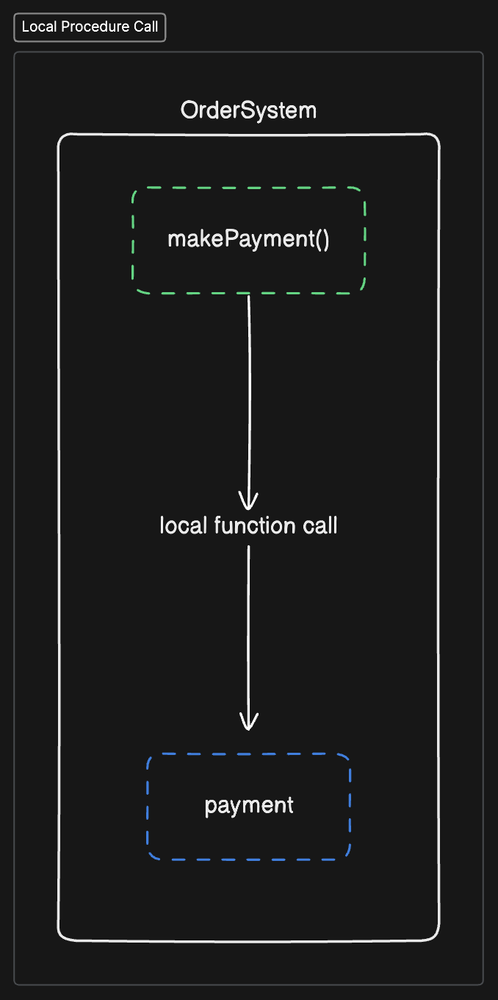
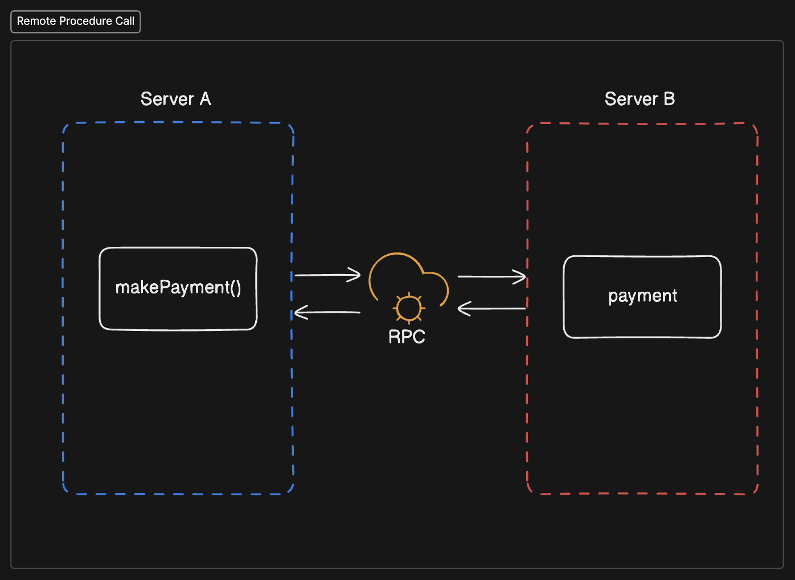
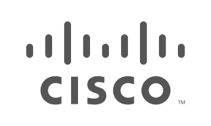
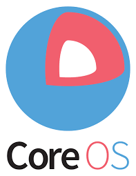
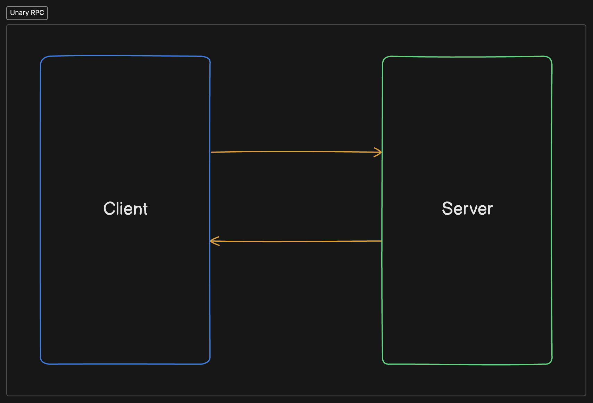
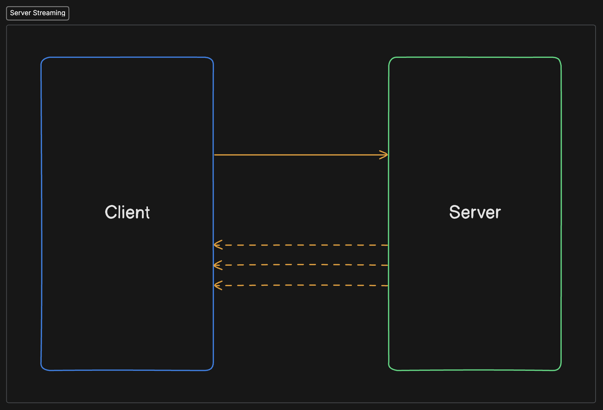
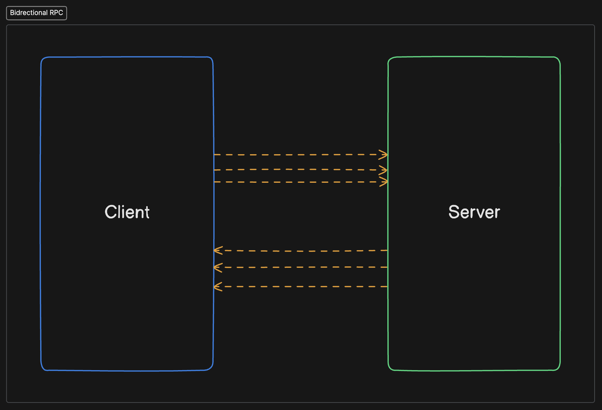
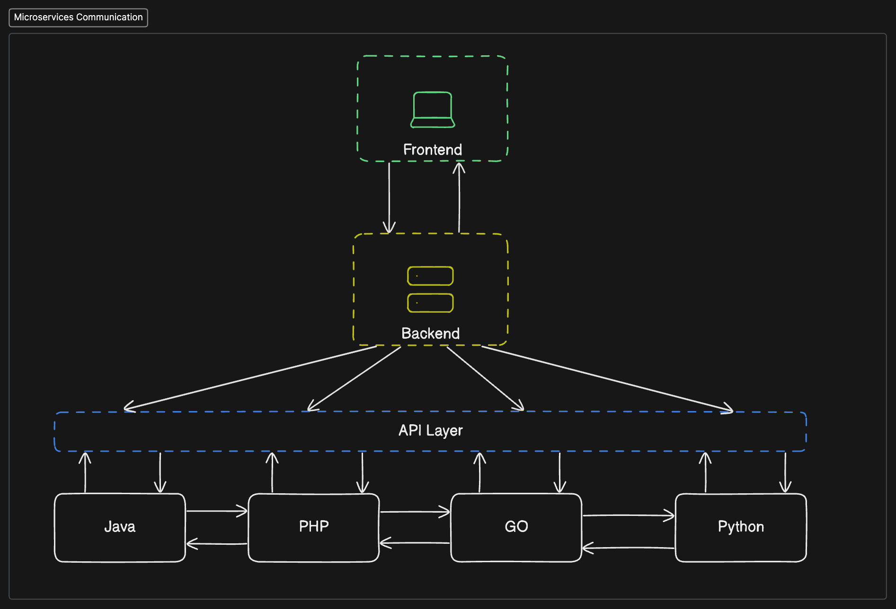
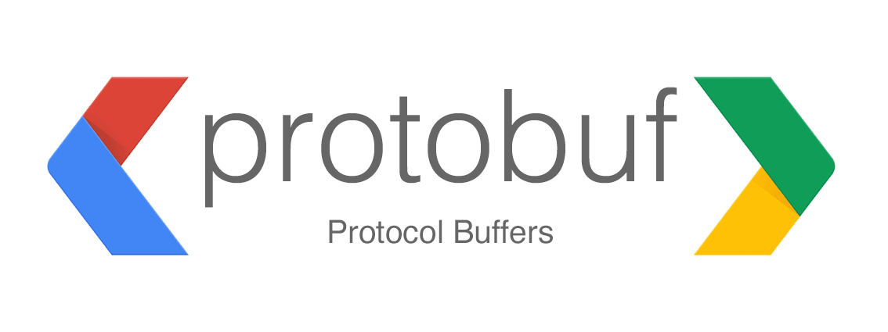
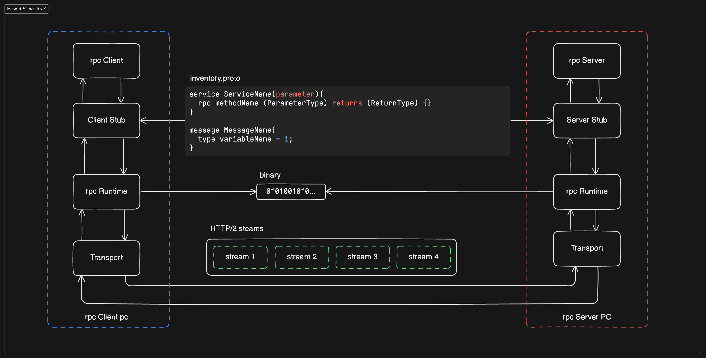

# Intro to RPC

RPC is mechanism that allows distributed systems to communicate. This repository gives a brief overview about RPC works under the hood and how to implement gRPC framework with a simple example application.

## What is RPC (Remote Procedure Call) ?

- A mechanism for client server communication

- A local function when called executes some code within its own address space


<p align="center" dir="auto">

</p>

- A remote procedure call gets executed but in a different machine or address space

- The function call will seem to user as if it is calling a local function

- The implementation detail for both server and client will be same


<p align="center" dir="auto">


</p>

<br>
<br>
<br>

## What is gRPC ?

<p align="center" dir="auto">
<a src="https://grpc.io/">


</a>
</p>

<br/>

- An open source framework released by google in 2015

- Built on HTTP 2.0 and uses protocol buffers

- A rewrite of their internal rpc implementation

- A language agnostic and operating system agnostic framework

- Used by large companies for communicating between their various microservices

<br/>
<br/>
<br/>

<table align="center" >
<tr>
<td>
<a >



</a>
</td>

<td>
<a >


</a>
</td>

<td>
<a >



</a>

</td>
</tr>
<tr>
<td>
<a href="">


</a>
</td>
<td>
<a href="">


</a>
</td>

<td>
<a href="">


</a>
</td>
</tr>
</table>

<br>
<br>

- Supported in a wide array of programming languages

<br>

<table align="center">
<tr>
<td >

<p align="center">


</p>

<p align="center">C++</p>

</td>

<td >

<p align="center">

</p>

<p align="center">Ruby</p>
</td>


<td >

<p align="center">

</p>

<p align="center">C#</p>
</td>

<td >

<p align="center" >

</p>

<div>

<p align="center">GO</p>
</div>
</td>
</tr>


<tr >


<td >


<div>

<p align="center">PHP</p>
</div>
</td>


<td >


<p align="center">Python</p>


</td>


<td >


<div>

<p align="center">Java</p>

</div>

</td>


<td >


<p align="center">Node JS</p>


</td>

</tr>


</table>

<br>
<br>
<br>

## Types of API Implementation through gRPC

### Unary RPC

- Simple client server communication

- Client invokes a function on the server and gets back response

<br>
<br>
<p align="center">

</p>
<br>


### Sever Streaming

- Client invokes a method on server

- Get a stream of response back

- Client reads the response after server has finish sending


<br>
<br>
<p align="center">

</p>
<br>


### Client Streaming

- Client sends a sequence of messages to server

- Sever waits for the client to finish sending all the message

- After which it prepares response


<br>
<br>
<p align="center">

</p>
<br>


### Bi-directional

- Allows both ways

- Either client can send a stream of message and server waits

- Or server sends a stream of response and client waits

- Or client and server pass message and get response in a ping pong manner


<br>
<br>
<p align="center">

</p>
<br>


<br>

## Motivation

### Microservice communication

- In a distributed system using each service can be written in different programming language

- Each service needs to have an HTTP Client implementation if using REST for communication


<br>
<br>
<p align="center">

</p>

<br>

- Maintaining HTTP clients for different programming language are difficult

- gRPC provides a single library for all the clients

- Maintenance by the open source community for each language in a single unified repo

- No need to create or maintain your own http client library


### HTTP 2 Protocol

- Use of http 2 protocol as a hidden implementation brings a lot of benefits

- Since it is hidden any updates to the protocol does not effect the client or server application

### Performing Actions

- Easy to create and perform actions on server


### Use of Protocol Buffers

- gRPC uses Protocol Buffer as a message serialization and deserialization format

- RPC comes in other format as well suc as 
    - HTTP RPC
    - JSON RPC

- gRPC allows faster serialization and deserialization than JSON

- Language agnostic


## Why use Protocol Buffers instead of JSON ?

<br>
<br>
<p align="center">


</p>
<br>

- A open format developed by google for serializing structured data

- Messages are converted into binary format when serialized with a ``.proto`` file using the ``protoc`` compiler

- Allows faster message passing as it converts it into binary

- Language and platform agnostic format

- Data structure in this format are staticly typed

- The services defined when using gRPC to be used by client and server are written in ``.proto`` file

- It has the following structure

```proto

// The greeter service definition.
service Greeter {
  // Sends a greeting
  rpc SayHello (HelloRequest) returns (HelloReply) {}
}

// The request message containing the user's name.
message HelloRequest {
  string name = 1;
}

// The response message containing the greetings
message HelloReply {
  string message = 1;
}

```

- Each data that will be sent or received are placed in a message

- Each message has a strongly typed property that defines the type of data it takes and will receive

- Defining a RPC service is placed under a ``service`` block where the function is defined 

- The function accepts parameter type and return type as well

- This service definition defines the schema to generate code between server and client


## How does RPC(gRPC) actually work ?

<br>
<br>

<p align="center">


</p>

<br>

<br>
<p align="center">


</p>

<p align="center">Source : https://grpc.io/docs/what-is-grpc/introduction</p>

<br>
<br>

## Pros and Cons

### Pros
- Fast and space efficient message passing

- Only one library for any language

- Allows native upload feedback

- Cancelling request functionality

- Use of protocol Buffers


### Cons

- Defining the schema can become a hassle

- Client can become bloated

- Steep learning curve

- No proper error handling

- No proper browser support

- Handling timeouts can become complicated

<br>
<br>
<br>

# Reference and Further Resouces
- https://grpc.io/docs/what-is-grpc/introduction/

- [Byte Byte Go - gRPC introduction video](https://youtu.be/gnchfOojMk4?si=gMCe3B3RCl4qjAAr)

- https://www.geeksforgeeks.org/remote-procedure-call-rpc-in-operating-system/

- https://en.wikipedia.org/wiki/Remote_procedure_call

- [gRPC crash course by Hussein Nasser](https://youtu.be/Yw4rkaTc0f8)

- [IBM What is gRPC](https://youtu.be/hVrwuMnCtok)

- [tRPC, gRPC, GraphQL or REST: when to use what? By Software Dev Diaries](https://www.youtube.com/watch?v=veAb1fSp1Lk&pp=ygUDcnBj)

- [REST vs RPC vs GraphQL API - How do I pick the right API paradigm? by Ambient Coder](https://www.youtube.com/watch?v=hkXzsB8D_mo&pp=ygUDcnBj)

- [Where should you use gRPC? And where NOT to use it! by CodeOpinion](https://www.youtube.com/watch?v=4SuFtQV8RCk&pp=ygUDcnBj)


# Examples

- [demo-example](https://github.com/Anindra123/intro-to-rpc/tree/main/demo_example)
- [todo-example](https://github.com/Anindra123/intro-to-rpc/tree/main/todo_example)


